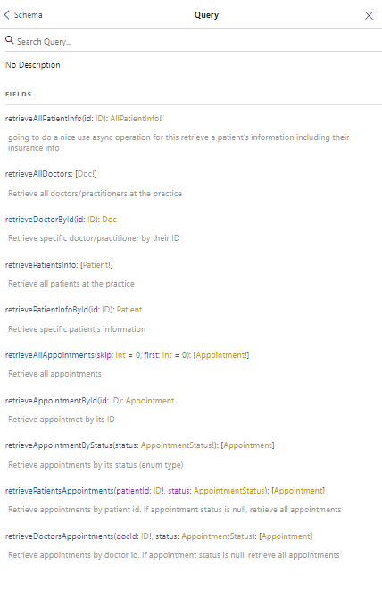
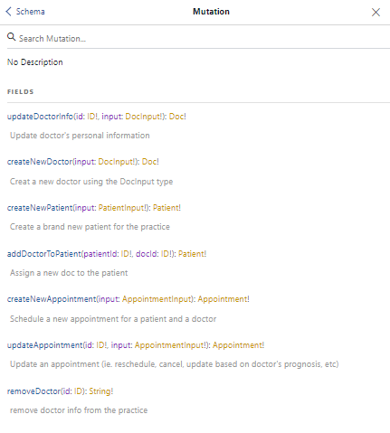
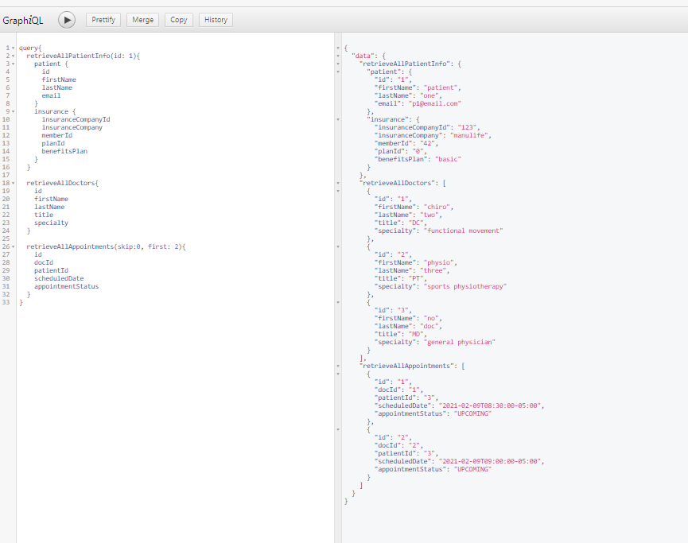
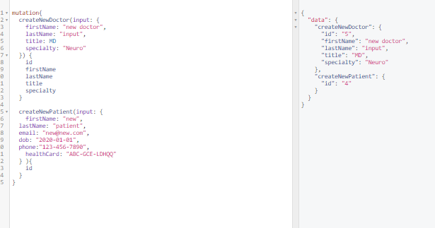
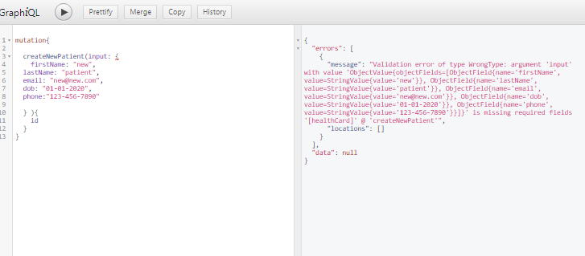
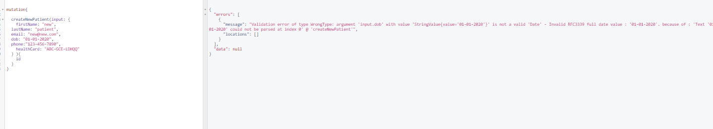
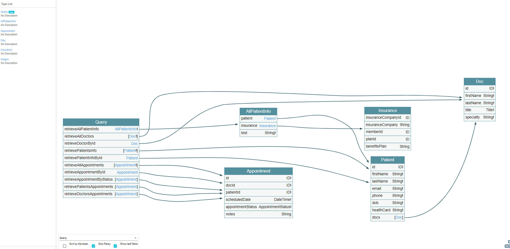

### GraphQL APIs

The following screenshots show example queries/mutations and their results from using the 
GraphQL APIs through the Graphiql interface

All queries can be examined through the graphiql interface at: `http://localhost:8080/graphiql`

The voyager interface can also be accessed through: `http://localhost:8080/voyager`

